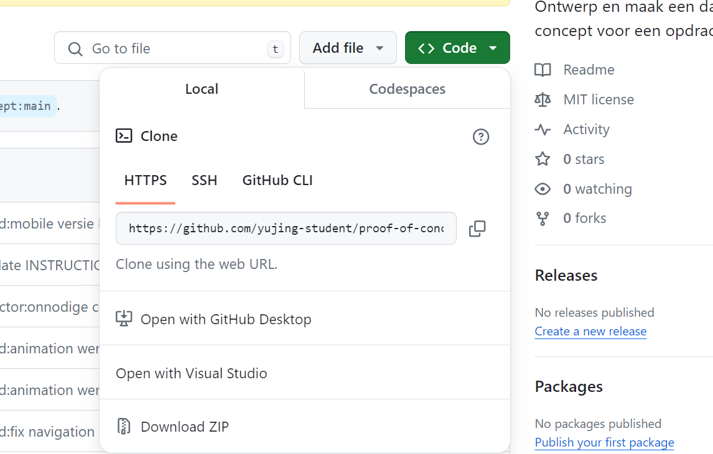
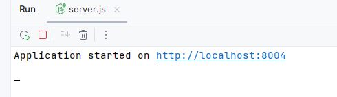

> _Fork_ deze leertaak en ga aan de slag. Onderstaande outline ga je gedurende deze taak in jouw eigen GitHub omgeving uitwerken. De instructie vind je in: [docs/INSTRUCTIONS.md](docs/INSTRUCTIONS.md)

# Titel
<!-- Geef je project een titel en schrijf in één zin wat het is -->

radio station BNR business beats om muziek te luisteren


## Inhoudsopgave

  * [Beschrijving](#beschrijving)
  * [Gebruik](#gebruik)
  * [Kenmerken](#kenmerken)
  * [Installatie](#installatie)
  * [Bronnen](#bronnen)
  * [Licentie](#licentie)

## Beschrijving
<!-- Bij Beschrijving staat kort beschreven wat voor project het is en wat je hebt gemaakt -->
<!-- Voeg een mooie poster visual toe 📸 -->
<!-- Voeg een link toe naar Github Pages 🌐-->


In dit project heb ik een radio station gemaakt waar je muziek kan luisteren.
Het is een radio station van BNR business beats. 
Je kan de muziek aan en uit zetten en het volume aanpassen.
Ook kan je nieuwsartikelen zien


## Gebruik
<!-- Bij Gebruik staat de user story, hoe het werkt en wat je er mee kan. -->
als gebruiker wil ik muziek kunnen luisteren op een radio station van BNR business beats.

## Kenmerken
<!-- Bij Kenmerken staat welke technieken zijn gebruikt en hoe. Wat is de HTML structuur? Wat zijn de belangrijkste dingen in CSS? Wat is er met JS gedaan en hoe? Misschien heb je iets met NodeJS gedaan, of heb je een framwork of library gebruikt? -->
Ik heb gebruik gemaakt van HTML, CSS en JavaScript.
In de HTML heb ik een audio tag gebruikt om de muziek af te spelen.
In de CSS heb ik de layout gemaakt en de styling.
In de JavaScript heb ik de functionaliteit gemaakt om de muziek aan en 
uit te zetten en het volume aan te passen.

ook heb ik gelet op progressive enhancement en heb ik de website responsive gemaakt door mobile first te beginnen.


dit is een snel overzichtmet de Kenmerken
* sever-side rendering
* `EJS`
* `Node`
* `Express`
* `CSS`
* `javascript`

<h3>links naar documentatie</h3>

<ul>
<li><a href="https://ejs.co/">ejs documentatie</a></li>
<li><a href="https://nodejs.org/">nodejs documentatie installeren is vereist</a></li>
<li><a href="https://expressjs.com/">express documentatie</a></li>
 <li><a href="https://code.visualstudio.com/">code editor visuel studio code</a></li>
</ul>

EJS (Embedded JavaScript Templates) is een template engine voor Node.js waarmee je dynamische HTML-pagina's kunt maken. Express.js is een framework voor webapplicaties in Node.js dat goed samenwerkt met EJS.

Node.js is een open-source, cross-platform runtime-omgeving voor JavaScript. Het maakt het mogelijk om JavaScript-code uit te voeren buiten een webbrowser, waardoor je er servers, netwerktoepassingen en andere tools mee kunt bouwen.

Express is een populair framework voor het bouwen van webapplicaties in Node.js. Het biedt een robuuste set functies om efficiënt en schaalbaar web- en mobiele backends te ontwikkelen.

Visuel studiocode is de code editor die je kan gebruiken om dit project te gebruiken

## Installatie
<!-- Bij Instalatie staat hoe een andere developer aan jouw repo kan werken -->

je drukt op de groene knop code en kopieert de link en plakt die in de terminal. of je download de zip file.


1. Clone de repository
```bash 
git clone https://github.com/yujing-student/proof-of-concept.git
```

na het clonen van de repository doe je npm install
```bash
npm install
```
en daarna doe je in de terminal 
```bash
npm  start
```

vervolgens zie je dit in de terminal :
<br>


<br>
en je drukt op de link en dan
kan je de website openen in de browser.


## Bronnen

## Licentie

This project is licensed under the terms of the [MIT license](./LICENSE).
